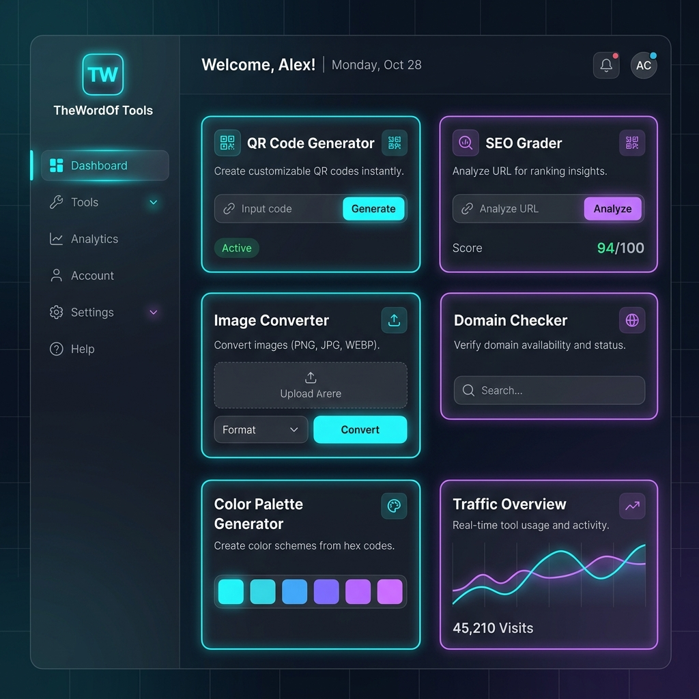
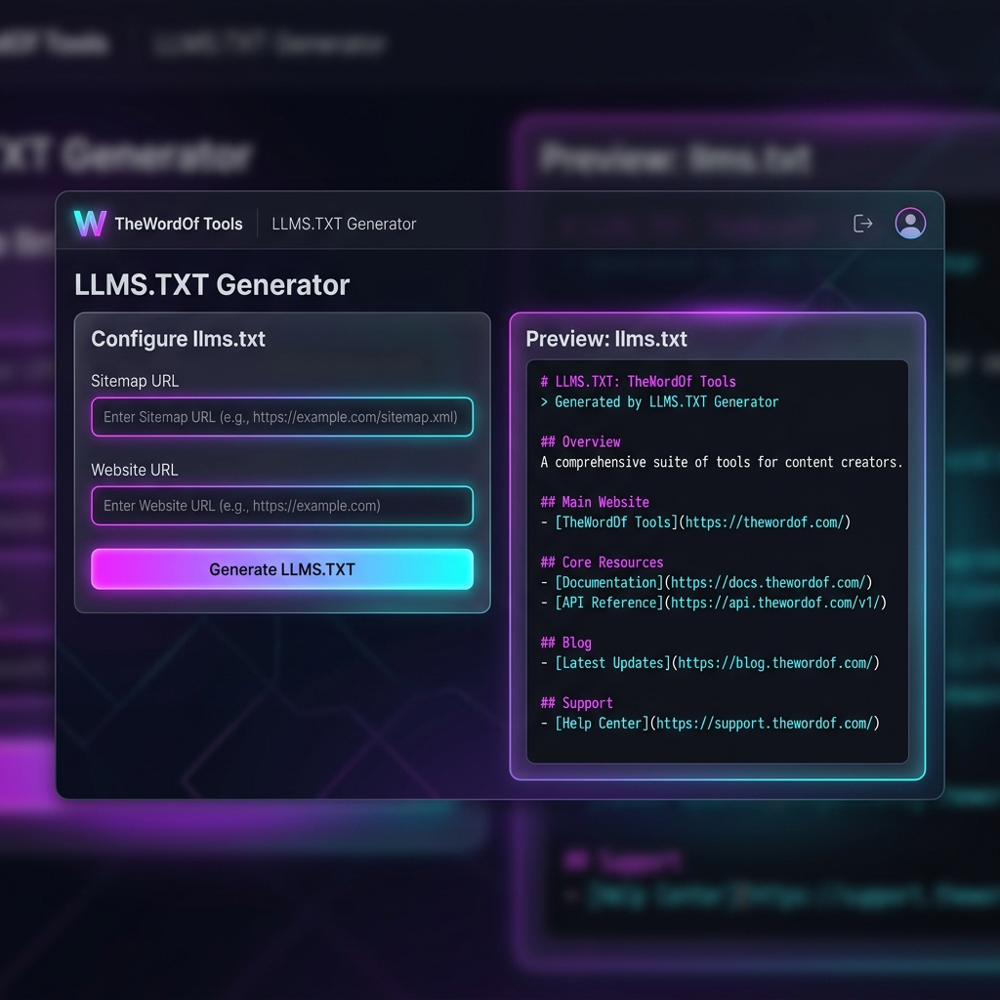

# TheWordOf Tools Suite (v1.2.2)

A highly optimized, premium utility and generator suite built using Next.js 16 (App Router), React 19, Tailwind CSS v4, and Prisma. The suite provides custom developer, designer, calculator, and productivity tools utilizing a premium glassmorphism design system.


*Desktop Dashboard Overview*


*Tool Detail View (LLMS.TXT Generator in Action)*

## Features & Included Tools

Our suite includes a curated collection of 35+ tools organized under cohesive layout groups, featuring client-side usage limits and SEO tracking:

- **Image & Code**: Image Converter, SVG Compressor, QR Code Generator, Code Minifier, Text Difference
- **Calculators**: EMI Calculator, SIP / Mutual Fund, Compound Interest, Salary to Hourly, GST Calculator, BMI Calculator, Aspect Ratio, Line-height, PX to REM, Word Counter, Color Converter
- **Document Tools**: Doc Converter, Invoice Generator, PDF Merger, PDF Watermarker, Work Report
- **Design Tools**: Color Contrast, Contrast Scanner, Color Palette, Gradient Generator, Gradient Palette
- **Technical SEO**: Schema Generator, Robots.txt Generator, Sitemap Validator, LLMS.TXT Generator, SERP Previewer, Keyword Density, SEO Readability, Broken Links
- **AI Tools**: Product Description Generator, Caption Generator, Prompt Generator, ATS Score Checker, Resume Analyzer, Resume Fixer/Improver, CV Builder

---

## Tech Stack & Architecture

- **Framework**: [Next.js 16](https://nextjs.org/) (App Router, Turbopack, SSR/CSR boundary split)
- **Runtime & Language**: Node.js, React 19, TypeScript
- **Styling**: Tailwind CSS v4 + Vanilla CSS variables, premium glassmorphism classes (`.glassmorphism`)
- **Database & ORM**: PostgreSQL, Prisma (for usage logging & account persistence)
- **Analytics & Usage Tracking**: Debounced local storage fallback & Server API (`/api/usage`) with metadata payloads

---

## Development & Operations

### Getting Started

1. Clone this repository.
2. Install dependencies:
   ```bash
   npm install
   ```
3. Set up your `.env` file with `DATABASE_URL` and Auth details.
4. Run the development server:
   ```bash
   npm run dev
   ```
5. Open [http://localhost:3000](http://localhost:3000) to view the application.

### Quality Assurance & Building

To verify code health, linting, and compile successfully, run the automated verification script:
```bash
npm run qa
```

To build for production:
```bash
npm run build
```
